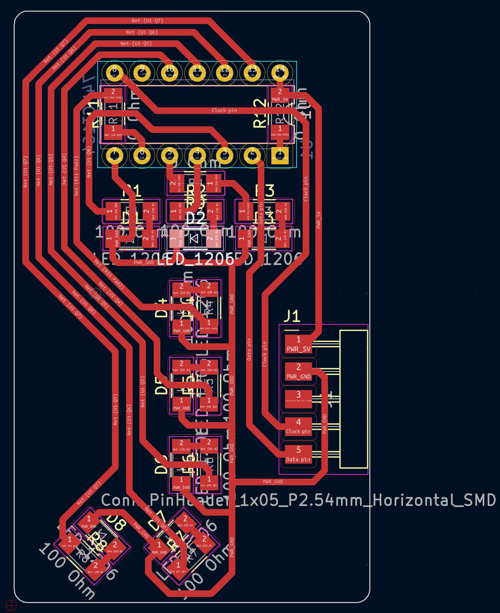

# esp32c3-web-leds

## Tilgangur

Búa til viðbót við [Fab Xiao bretti FLA](https://github.com/Fab-Lab-Akureyri/fla-xiao) (útgáfa af bretti [Adrian Torres](https://fabacademy.org/2020/labs/leon/students/adrian-torres/fabxiao.html)). 

Notast við [74HCT164 shift register](https://www.diodes.com/assets/Datasheets/74HCT164.pdf) til að keyra 8 LED á einum útgangspinna. 

Tengist WiFi og hægt að kveikja og slökkva á hverju LED-i fyrir sig í vefviðmóti. 

## Myndir

Ath: Guli vírinn er útaf "prótótýpu", ekki skv teikningu =)

## Kóði

Skrifað í VSCode með Platform.io, en ætti að nægja að afrita úr main.cpp í Arduino IDE. 

Ath, bæta esp32c3 við Arduino IDE, sjá t.d. [hér](https://dev.to/rafalozan0/esp32-c3-12f-using-the-arduino-ide-getting-started-environment-setup-38ij). 

Kóði byggður á [þessu](https://www.instructables.com/Web-Controlled-Desk-Lamp-With-XIAO-ESP32-C3/).

## KiCad

Rafrásin er búin til í KiCad, sjá `shifter` möppuna. 

## BOM

|   Íhlutir |   Týpa    |   Fjöldi  |
|   ---     |   ---     |   ---     |
| [74HCT164N](https://www.digikey.com/en/products/detail/nxp-usa-inc/74hct164n-652/763124)              |   Stjakgesti  |   1   |
| [LED](https://www.digikey.com/en/products/detail/w%C3%BCrth-elektronik/150120BS75000/4489933)         |   Viðnám      |   8   |
| [0Ω](https://www.digikey.com/en/products/detail/yageo/RC1206FR-070RL/5698945)                         |   Viðnám      |   3   |
| [100Ω](https://www.digikey.com/en/products/detail/yageo/RC1206FR-07100RL/728491)                      |   Viðnám      |   8   |
| [1x05](https://www.digikey.com/en/products/detail/sullins-connector-solutions/GBC36SGSN-M89/862355)   |   Pinnatengi  |   1   |